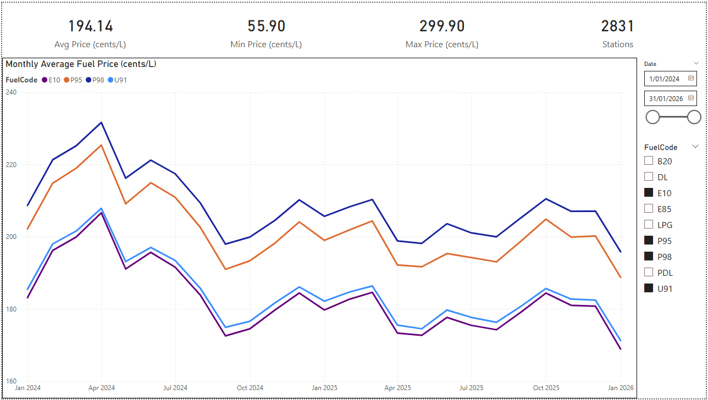
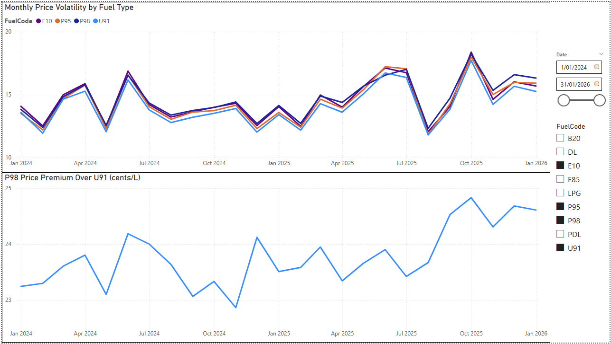
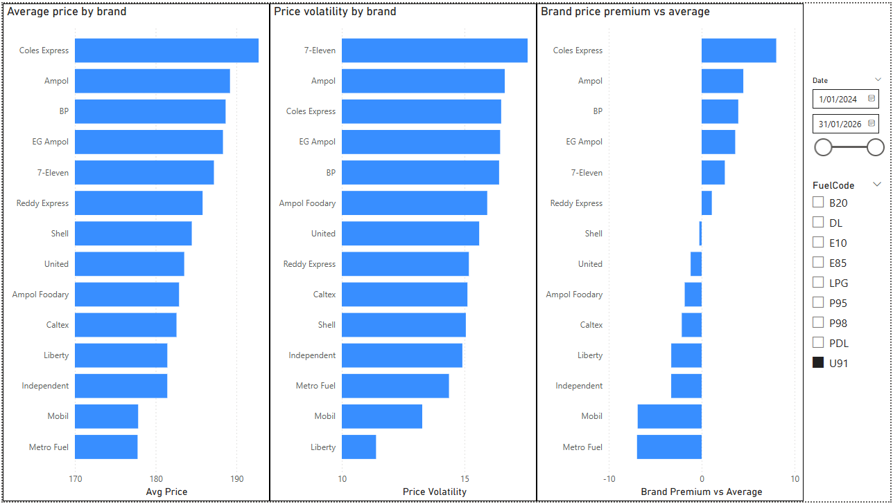
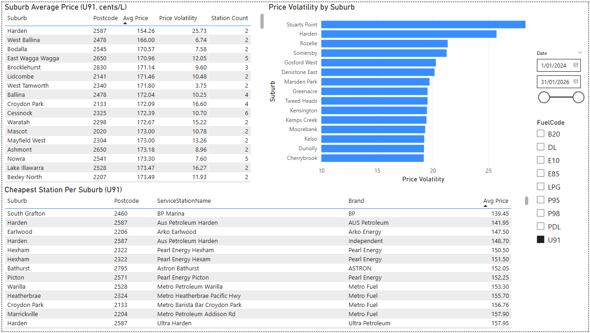

# FuelCheck Price Analysis

A Data Analyst and BI Analyst portfolio project analysing fuel price behaviour across NSW and ACT using ~1.75 million records from the NSW Government FuelCheck dataset.

---

## Dashboard Preview

### Overview


### Fuel Price Trends


### Brand Analysis


### Geographic Analysis


---

## Project Overview

This project ingests, cleans, and analyses 25 months of historical fuel pricing data (January 2024 – January 2026) sourced from the NSW Government FuelCheck portal. The goal is to produce defensible trend, brand, and geographic insights and present them in an interactive Power BI dashboard.

The project demonstrates the full analytics workflow: raw data ingestion, validation, exploratory analysis, bias detection, normalisation, and reporting.

---

## Tools & Technologies

| Tool | Purpose |
|---|---|
| Python (pandas) | File consolidation and ETL |
| SQL Server | Data storage, validation, and analysis |
| Power BI | Interactive dashboard and reporting |
| Git / GitHub | Version control |

---

## Project Structure

```
fuelcheck-price-analysis/
├── etl/
│   └── 01_combine_raw_files.py       # Consolidates 25 monthly CSV/xlsx files
├── sql/
│   ├── 01_setup.sql                  # Database and table creation
│   ├── 02_validation_and_typing.sql  # Type conversion and bad data removal
│   ├── 03_eda.sql                    # Exploratory data analysis
│   ├── 04_normalisation.sql          # Polling bias removal
│   └── 05_analysis.sql              # Final analytical outputs
├── dashboards/
│   └── fuelcheck_price_analysis.pbix # Interactive Power BI dashboard
├── exports/                          # Dashboard screenshots and PDF export
└── docs/                             # Supporting documentation
```

---

## Data Source

- **Source:** [NSW Government FuelCheck](https://www.nsw.gov.au/driving-boating-and-transport/vehicle-registration/managing-registration/fuelcheck)
- **Coverage:** NSW and ACT
- **Period:** January 2024 – January 2026
- **Format:** 25 monthly CSV and Excel files
- **Raw row count:** ~1.85 million rows
- **Clean row count:** 1,750,341 rows (after removal of 99,094 bad-date rows)
- **Normalised row count:** 1,249,066 daily observations

---

## How to Run

1. Place monthly source files in the `raw_data/` folder
2. Run `etl/01_combine_raw_files.py` to produce `staging/combined_data.csv`
3. Import `combined_data.csv` into SQL Server as `dbo.fuel_prices_raw`
4. Execute SQL files in order: `01` → `02` → `03` → `04` → `05`
5. Open `dashboards/fuelcheck_price_analysis.pbix` in Power BI Desktop and refresh the data connection

> Raw data and staging files are excluded from this repository via `.gitignore`. Source files are publicly available from the NSW Government FuelCheck portal.

---

## Key Findings

### Polling Bias Discovery
During EDA, certain stations were found to record 20–40+ price updates per day for the same fuel type. Drilling into a specific case — Ampol Foodary Werrington (P98, 2024-08-02) — revealed 38 records in a single day with prices alternating by a few cents every ~14–16 minutes.

This confirmed the dataset represents **periodic polling snapshots**, not genuine price change events. Using raw observations directly would overweight frequently-polled stations in any aggregate, producing distorted averages.

**Resolution:** `04_normalisation.sql` reduces the dataset to one row per station + fuel type + day using `AVG(Price)` as the daily price. This reduced 1,750,341 rows to 1,249,066 daily observations.

---

### Brand Findings (U91)
- **Coles Express** is the most expensive brand, charging ~8 cents above the dataset average
- **Metro Fuel and Mobil** are consistently the cheapest, sitting ~8–10 cents below average
- **7-Eleven** has the highest price volatility despite being mid-range on average price, suggesting aggressive price cycling behaviour
- **Shell and Reddy Express** sit almost exactly at the market average
- **Liberty and Mobil** have the lowest volatility — they hold prices more steadily than competitors

---

### Trend Findings
- Fuel prices dropped significantly across all fuel types in mid-2024 before partially recovering
- All fuel types cycle in lockstep — volatility spikes and dips together, suggesting market-wide pricing events rather than individual brand behaviour
- The **P98 premium over U91 has been widening** — from ~23 cents in early 2024 to ~24.7 cents by late 2025, with a sharp acceleration in the final months of the dataset

---

### Geographic Findings (U91)
- **South Grafton** has the cheapest station in the dataset — BP Marina at 139.45 cents/L
- **Harden** has the highest price volatility of any suburb with 2+ stations, and also ranks as the cheapest suburb on average — suggesting frequent but low price cycles
- **Stuarts Point** is the most volatile suburb in the dataset by a significant margin
- **Metro Fuel dominates** the cheapest station per suburb rankings, appearing consistently across regional NSW

---

### Data Quality Findings
- **99,094 rows** removed due to sentinel date 1900-01-01 (failed date parsing during import)
- **457 station + fuel code + date groups** had multiple brand values in the source data — 442 (97%) were the result of Ampol vs Ampol Foodary labelling inconsistency, a known sub-brand issue in the FuelCheck dataset
- **Geographic scope verified** — edge case postcodes (2902–2914 ACT, 3644 rural NSW, 4383 border NSW) all confirmed as valid locations within scope

---

## Analytical Outputs

All analysis queries in `05_analysis.sql` use `dbo.fuel_prices_daily` as the source.

| Section | Output |
|---|---|
| 1a | Monthly average price by fuel type |
| 1b | Monthly price volatility by fuel type |
| 2a | Overall average price by fuel type |
| 2b | Monthly P98 price premium over U91 |
| 3a | Average price by brand |
| 3b | Brand price volatility |
| 3c | Brand price premium vs dataset average |
| 4a | Cheapest vs most expensive suburbs |
| 4b | Suburb price volatility |
| 4c | Cheapest station per suburb |

---

## Design Decisions

**Why `AVG(Price)` instead of latest snapshot for daily normalisation?**
Intraday prices alternate irregularly. The final poll of the day is not reliably more representative than any other snapshot, so the daily average is the more defensible central estimate.

**Why are views not used for the analysis layer?**
Power BI connects directly to `dbo.fuel_prices_daily`, which already serves as a pre-aggregated analytical base. Adding views would introduce a layer without adding value in a single-analyst, single-stack project.

**Why are single-station suburbs excluded from geographic analysis?**
A suburb represented by one station produces a metric that reflects that station's pricing strategy rather than the suburb's market. A minimum of two stations is required for a result to be considered representative.

**Why use `CONCAT(ServiceStationName, '|', Suburb, '|', Postcode)` for station counts?**
Counting by name alone undercounts physical locations because chain brands share the same name across hundreds of suburbs. Concatenating name, suburb, and postcode creates a unique key per physical location for accurate station counts.

**Why is Brand excluded from the normalisation GROUP BY?**
Brand was found to vary across records for the same station, fuel code, and date — primarily due to Ampol vs Ampol Foodary labelling inconsistencies in the source data. Including Brand in the GROUP BY would produce duplicate rows. `MAX(Brand)` is used as a deterministic tiebreaker instead.
